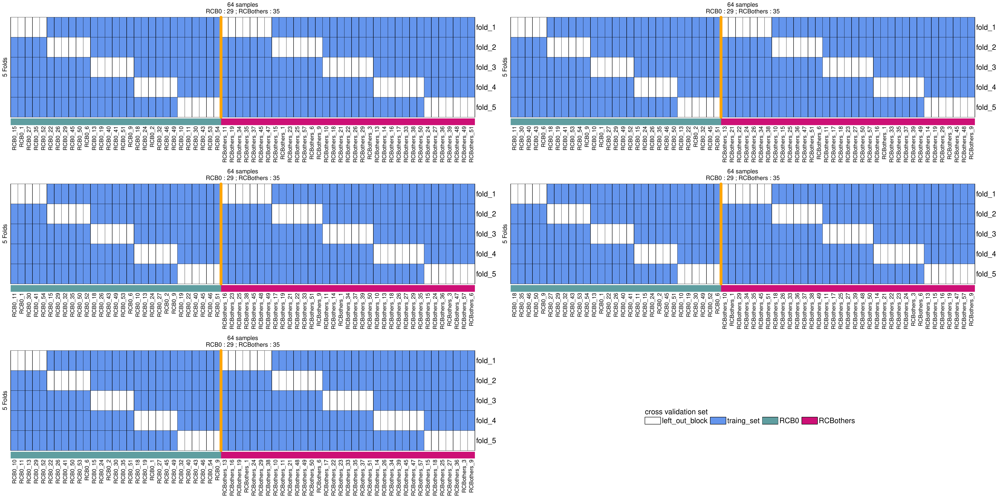

# REFERENCE-FREE RNA PROFILING PREDICTS TRIPLE NEGATIVE BREAST CANCER CHEMORESISTANCE TO NEOADJUVANT TREATMENT

## Scripts
- get gene counts with kallisto (adapt input variables to your own data in "input variables") : https://github.com/MorillonLab/DIS3_analysis/blob/main/getKallistoCounts.sh
- get randomized split samples into discovery & validation ; by default : 60/40 (adapt input variables to your own data in "input variables") : https://github.com/MorillonLab/TNBC_reference_free_RNA_profiling_RCB0_vs_RCBothers_pre_NAC/blob/main/getRandomizedSplitSamples.sh
    - Be careful, once you have run the script, `train_test_cond1_cond2.txt` is produced, if you are comparing kmers & genes, you should use this same file for both !!
  
- get differential expression by 5x5 folds selection, inspired by the Leave-P-out cross-validaton. Samples of each condition are divided into 5 blocks. For each condition, one block is left-out, and the conditions are compared with a zero-inflated wilcoxon rank test (without the left-out block). The process is reconducted, until all the blocks have been at least once the left-out block. The process is repeated X times, by randomizing the samples. In the end, we obtain 25 tables of differentially expressed features :

  -1) Samples of each condition are divided into 5 blocks. For each condition, one block is left-out

     -  Run https://github.com/MorillonLab/TNBC_reference_free_RNA_profiling_RCB0_vs_RCBothers_pre_NAC/blob/main/run_make_cross_validation_partitioning.sh (adapt it to your needs)
       
     - It will call https://github.com/MorillonLab/TNBC_reference_free_RNA_profiling_RCB0_vs_RCBothers_pre_NAC/blob/main/config_NRTZA_TNBC_RCB0_vs_RCB123_curie_and_canada_10Folds5rep.json (adapt it to your needs) and https://github.com/MorillonLab/TNBC_reference_free_RNA_profiling_RCB0_vs_RCBothers_pre_NAC/blob/main/Snakefile
       
     - https://github.com/MorillonLab/TNBC_reference_free_RNA_profiling_RCB0_vs_RCBothers_pre_NAC/blob/main/Snakefile will call https://github.com/MorillonLab/TNBC_reference_free_RNA_profiling_RCB0_vs_RCBothers_pre_NAC/blob/main/split_cv.sh (they need to be in the same directory)
 
     - Results : tables of train and test sets from samples of both conditions (test sets are the left-out blocks)
     - Credits for the scripts : Daniel GAUTHERET (daniel.gautheret@universite-paris-saclay.fr, team leader), Hugues HERRMANN (hugues.herrmann@universite-paris-saclay.fr), Haoliang XUE (xue.haoliang@outlook.com)
     
     Here is the visual result to compare the conditions by a 5x5-fold selection :
  
   

  -2) Conditions are compared with a zero-inflated wilcoxon rank test, without the left-out block

    -  Run https://github.com/MorillonLab/TNBC_reference_free_RNA_profiling_RCB0_vs_RCBothers_pre_NAC/blob/main/getCrossValidationAnalysis.sh (adapt input variables to your own data in "input variables")
    -  It will call https://github.com/MorillonLab/TNBC_reference_free_RNA_profiling_RCB0_vs_RCBothers_pre_NAC/blob/main/getGroupedCounts.awk & https://github.com/MorillonLab/TNBC_reference_free_RNA_profiling_RCB0_vs_RCBothers_pre_NAC/blob/main/getZIWfromValues.R (you have to adapt their path in "input variables")
 

## Contacts 

marc.gabriel@curie.fr (bioinfo)

nouritza.torossian@chu-orleans.fr (1st author)

antonin.morillon@curie.fr (team leader, last author)

